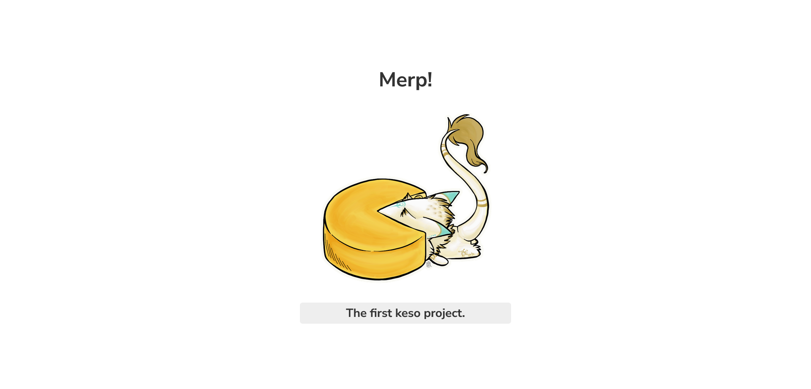

# ¡Bienvenido/a al Keso Framework PHP!



Keso Framework PHP es un framework de desarrollo web rápido y ligero para PHP. Está diseñado para facilitar la creación de aplicaciones web eficientes y escalables.

Con Keso Framework PHP, puedes aprovechar una amplia gama de características y herramientas para acelerar el desarrollo de tu aplicación. Algunas de las características clave incluyen:

* Enrutamiento flexible: Keso Framework PHP proporciona un sistema de enrutamiento potente y flexible que te permite definir fácilmente las rutas de tu aplicación y asociarlas con controladores específicos.
* Controladores y vistas: Puedes organizar tu lógica de aplicación en controladores y utilizar vistas para generar la salida HTML. Esto te permite separar claramente la lógica de presentación de tu aplicación.
* Documentación en español
* Linea de comandos: Ejecuta comandos para generar controladors o modelos con ```php merp```

¡Comienza a desarrollar con Keso Framework PHP y disfruta de una experiencia de desarrollo web rápida y eficiente!

## Novedades
- merp-cli - Ejecuta algunos comandos basicos desde la linea de comandos.

## Creditos
- Imagen por defecto de sergal ([Deviant Art](https://www.deviantart.com/michifishu/art/Cheese-wedge-Sergal-685836827))
- Inspirado en Laravel PHP

## todo
- Documentación
- Soporte de migraciones
- Soporte de webpack
- error handler